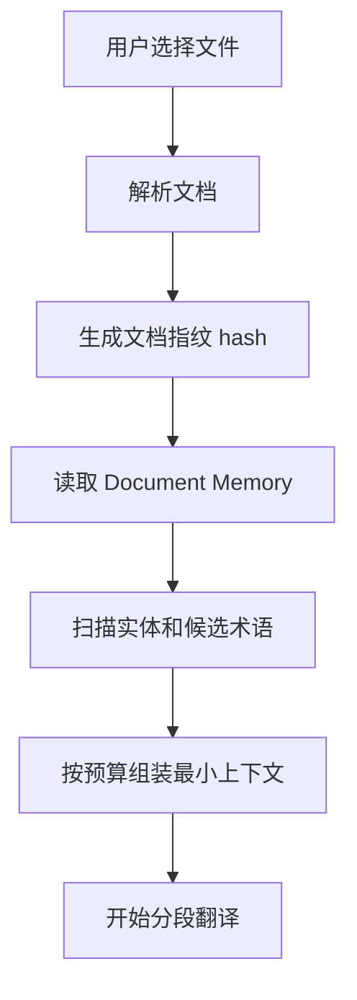

# 永久记忆 Agent 设计

## 1. 目标

为当前“英文转中文翻译工具”增加一个本地永久记忆 Agent，用于减少大模型调用 token、提升翻译一致性，并沉淀用户长期偏好、术语、文档上下文和项目状态。

该 Agent 不等同于把历史聊天或全文档全部塞进 prompt，而是采用“本地持久化 + 分层摘要 + 按需检索 + 小上下文注入”的方式工作。

核心目标：

- 减少重复传入术语、偏好、历史上下文造成的 token 浪费。
- 自动复用用户常用翻译风格、行业术语、客户名称、产品型号。
- 对同一批文档保持译名一致、语气一致、格式策略一致。
- 为后续授权、OCR、排版修复等开发任务保留长期项目记忆。
- 默认本地存储，不上传用户文档全文。

## 2. 记忆分层

### 2.1 Profile Memory：用户偏好记忆

保存用户长期稳定偏好。

示例：

```json
{
  "defaultEngine": "kimi",
  "defaultStyle": "business",
  "preferredOutputFormat": "docx",
  "translationTone": "专业、自然、不生硬",
  "layoutPreference": "优先保持原排版",
  "neverTranslate": ["GAMAK", "PI No.", "HS Code"]
}
```

使用方式：

- 每次翻译任务只注入短摘要，不注入完整历史。
- 用户修改设置时自动更新。
- 用户可在设置页查看和清除。

### 2.2 Term Memory：术语记忆

保存英文到中文的稳定映射。

来源：

- 用户导入术语表。
- 翻译完成后，从高频英文短语和译文中抽取候选术语。
- 用户手动确认后进入正式术语库。

状态：

| 状态 | 说明 |
| --- | --- |
| confirmed | 用户确认，翻译时强制使用 |
| candidate | 系统候选，不强制使用 |
| rejected | 用户拒绝，后续不再推荐 |

### 2.3 Document Memory：文档记忆

保存单个文档或同一项目批次的摘要，而不是保存完整 prompt。

示例：

```json
{
  "documentId": "hash-of-file",
  "fileName": "PI_No.GAC2026050701.pdf",
  "summary": "这是一份电机产品形式发票，包含买卖双方、产品规格、金额、付款方式和包装信息。",
  "entities": ["GAMAK", "Leo Miranda", "MOTOR", "USD"],
  "layoutHints": ["表格较多", "金额和型号不要翻译", "保留 PI 编号"],
  "lastTranslatedAt": "2026-05-17T12:00:00.000Z"
}
```

使用方式：

- 同一文档重试翻译时复用摘要和实体列表。
- 同一批文件翻译时共享项目上下文。
- 避免重复把整份文档上下文发给模型。

### 2.4 Project Memory：开发项目记忆

保存当前应用开发状态，减少后续开发上下文 token。

示例：

```json
{
  "completed": [
    "Kimi 翻译引擎",
    "API Key 测试连接",
    "无设备指纹授权设计",
    "历史记录持久化删除",
    "设置页运行环境自检"
  ],
  "pending": [
    "Python embedded runtime",
    "授权服务器签名令牌",
    "OCR 扫描版 PDF",
    "PDF 高保真回归测试"
  ],
  "importantDecisions": [
    "授权系统不采集硬件标识",
    "PDF 优先走 pdf2docx -> Word 模板重建",
    "默认引擎使用 Kimi"
  ]
}
```

该层主要服务开发 Agent，不直接进入用户文档翻译 prompt。

## 3. Token 节省策略

### 3.1 上下文预算

每次翻译请求设置严格预算：

| 内容 | 最大 token 占比 |
| --- | --- |
| 待翻译文本 | 70% |
| 强制术语 | 15% |
| 文档摘要 | 8% |
| 用户偏好 | 5% |
| 系统规则 | 2% |

超过预算时优先裁剪：

1. 候选术语。
2. 低相关历史摘要。
3. 非当前文件的项目上下文。

永远不裁剪：

- 当前待翻译文本。
- 用户确认术语。
- 不翻译清单。

### 3.2 分层摘要

对长文档不保存完整上下文，而是保存三种摘要：

| 摘要 | 用途 |
| --- | --- |
| document_summary | 文档整体含义 |
| page_summary | 页面级上下文 |
| table_summary | 表格字段和含义 |

翻译段落时只取：

- 当前页摘要。
- 文档总摘要。
- 与当前文本匹配的术语。

### 3.3 术语检索

不要每次塞入完整术语表。

检索规则：

1. 对当前文本做英文词组扫描。
2. 命中 confirmed 术语时注入。
3. 对 candidate 术语按相关度排序，只取前 20 条。
4. 超过 20 条时按出现频率和最长匹配优先。

### 3.4 翻译缓存

对稳定短文本建立缓存。

缓存 Key：

```text
sha256(engine + style + sourceText + confirmedTermsVersion)
```

适合缓存：

- 表头。
- 商品字段。
- 常见付款条款。
- 重复出现的地址、说明、标签。

不适合缓存：

- 大段上下文强相关段落。
- 用户临时修改过风格的任务。

## 4. Agent 工作流

### 4.1 翻译前



### 4.2 翻译中

每个文本块执行：

1. 检查翻译缓存。
2. 检索相关术语。
3. 注入文档摘要和用户偏好。
4. 调用模型。
5. 校验是否仍有大量英文残留。
6. 保存结果和候选术语。

### 4.3 翻译后

1. 更新文档摘要。
2. 统计高频未确认术语。
3. 生成“建议加入术语表”的候选项。
4. 保存翻译缓存。
5. 更新项目/用户偏好记忆。

## 5. 数据存储

短期可使用 JSON 文件，正式版本建议迁移 SQLite。

### 5.1 JSON 版本

目录：

```text
userData/
  memory/
    profile.json
    terms.json
    documents.json
    translation-cache.json
    project-memory.json
```

优点：

- 实现快。
- 便于调试。
- 适合当前桌面本地版。

缺点：

- 并发写入能力弱。
- 数据量大后检索慢。
- 不适合复杂筛选。

### 5.2 SQLite 版本

表结构：

```sql
CREATE TABLE memory_profile (
  key TEXT PRIMARY KEY,
  value TEXT NOT NULL,
  updated_at INTEGER NOT NULL
);

CREATE TABLE memory_terms (
  id TEXT PRIMARY KEY,
  source TEXT NOT NULL,
  target TEXT NOT NULL,
  status TEXT NOT NULL,
  frequency INTEGER NOT NULL DEFAULT 1,
  updated_at INTEGER NOT NULL
);

CREATE TABLE memory_documents (
  id TEXT PRIMARY KEY,
  file_hash TEXT NOT NULL,
  file_name TEXT NOT NULL,
  summary TEXT,
  entities TEXT,
  layout_hints TEXT,
  updated_at INTEGER NOT NULL
);

CREATE TABLE translation_cache (
  cache_key TEXT PRIMARY KEY,
  source_text TEXT NOT NULL,
  translated_text TEXT NOT NULL,
  engine TEXT NOT NULL,
  style TEXT NOT NULL,
  hit_count INTEGER NOT NULL DEFAULT 0,
  updated_at INTEGER NOT NULL
);
```

## 6. 代码模块设计

### 6.1 主进程服务

新增：

```text
src/main/services/memory.service.ts
```

职责：

- 读取/写入本地记忆。
- 术语检索。
- 翻译缓存读写。
- 文档摘要保存。
- 生成 prompt 上下文包。

核心接口：

```ts
interface MemoryContext {
  profileSummary: string;
  confirmedTerms: Array<{ source: string; target: string }>;
  documentSummary?: string;
  layoutHints: string[];
}

class MemoryService {
  getContextForText(args: {
    filePath: string;
    text: string;
    style: string;
  }): MemoryContext;

  getCachedTranslation(args: {
    engine: string;
    style: string;
    text: string;
  }): string | null;

  saveTranslation(args: {
    engine: string;
    style: string;
    source: string;
    target: string;
  }): void;

  updateDocumentMemory(args: {
    filePath: string;
    summary: string;
    entities: string[];
    layoutHints: string[];
  }): void;
}
```

### 6.2 Python 翻译引擎输入

当前 `translate_document` 已支持 `termTables`。

后续扩展：

```json
{
  "memoryContext": {
    "profileSummary": "用户偏好商务中文，保留金额、型号和品牌英文。",
    "confirmedTerms": [
      { "source": "Proforma Invoice", "target": "形式发票" }
    ],
    "documentSummary": "本文档是一份电机产品形式发票。",
    "layoutHints": ["保留 PI 编号", "表格字段短译"]
  }
}
```

Python 侧只负责使用上下文，不负责永久存储。

## 7. Prompt 组装策略

模板：

```text
你是专业英文到简体中文文档翻译引擎。
目标：翻译当前文本，保持原文含义和文档语气。

用户偏好：
{profileSummary}

文档上下文：
{documentSummary}

强制术语：
{confirmedTerms}

排版注意：
{layoutHints}

规则：
- 只返回译文。
- 保留金额、型号、邮箱、网址、编号。
- 不要解释。
- 不要添加原文没有的信息。

待翻译文本：
<text>{source}</text>
```

注意：

- `confirmedTerms` 只放当前文本相关项。
- `documentSummary` 控制在 80-150 中文字。
- `layoutHints` 控制在 5 条以内。

## 8. 隐私与可控性

必须提供：

- 记忆开关。
- 清空全部记忆。
- 清空当前文档记忆。
- 导出记忆。
- 不保存原文全文的选项。

默认策略：

- 保存术语和摘要。
- 不保存完整原文。
- 翻译缓存只保存短文本，默认限制单条源文本不超过 300 字符。

## 9. 分阶段实现

### Phase 1：本地 JSON 记忆

优先级 P0。

- 新增 `MemoryService`。
- 增加翻译缓存。
- 根据当前文本检索术语，减少完整术语表注入。
- 设置页增加记忆开关和清空按钮。

### Phase 2：文档记忆

优先级 P1。

- 保存文档摘要、实体和排版提示。
- 同一文件重试时复用摘要。
- 同一批文件共享项目上下文。

### Phase 3：候选术语学习

优先级 P1。

- 翻译后抽取候选术语。
- 设置页/术语页允许确认、拒绝、编辑。
- confirmed 术语进入强制注入。

### Phase 4：SQLite 与检索优化

优先级 P2。

- JSON 迁移 SQLite。
- 增加索引和清理策略。
- 可选接入本地 embedding 检索，但初期不建议引入，避免依赖过重。

## 10. 验收标准

- 同一文档重复翻译，重复短文本不再重复调用模型。
- 大术语表场景下，每次请求只注入当前相关术语。
- 翻译同一客户/产品文件时，名称和核心术语保持一致。
- 用户可一键清空记忆。
- 记忆文件中不出现完整大段原文。
- 平均请求 prompt token 下降 30% 以上。

## 11. 当前项目建议落地顺序

下一步建议直接实现 Phase 1：

1. `src/main/services/memory.service.ts`
2. `AppSettings.memoryEnabled`
3. `TranslateService` 调用缓存和术语检索
4. 设置页增加“记忆开关 / 清空记忆”
5. 翻译完成后写入短文本缓存

这一阶段不需要新模型、不需要联网、不需要向量数据库，收益最大且风险最低。
